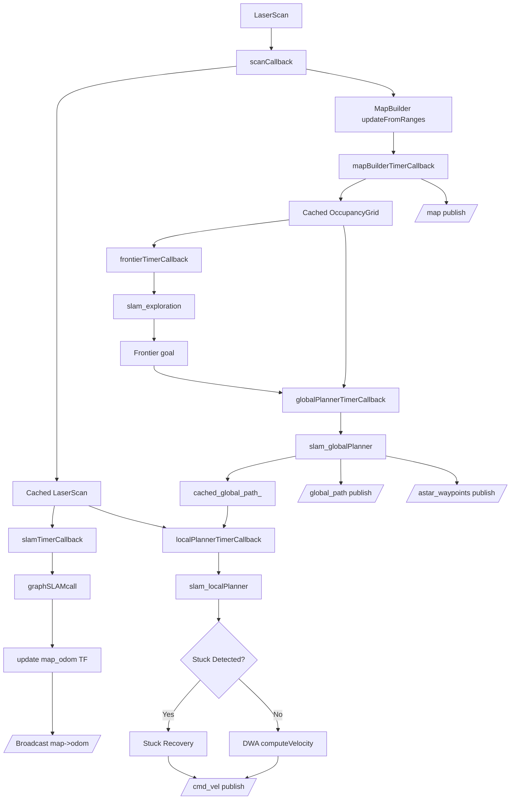

# AGV Pipeline

```mermaid
flowchart TD
    %% Sensors
    L[LaserScan] --> SC[scanCallback]
    SC --> CS[Cached LaserScan]
    SC --> MB[MapBuilder updateFromRanges]
    
    %% Map Builder Timer
    MB --> MAPT[mapBuilderTimerCallback]
    MAPT --> CG[Cached OccupancyGrid]
    MAPT --> MP[/map publish/]

    %% SLAM Timer
    CS --> SLAMT[slamTimerCallback]
    SLAMT --> G[graphSLAMcall]
    G --> GO[update map_odom TF]
    GO --> TF[/Broadcast map->odom/]

    %% Frontier Timer
    CG --> FT[frontierTimerCallback]
    FT --> FE[slam_exploration]
    FE --> FG[Frontier goal]

    %% Global Planner Timer
    FG --> AT[globalPlannerTimerCallback]
    CG --> AT
    AT --> AP[slam_globalPlanner]
    AP --> PATH[cached_global_path_]
    AP --> GP[/global_path publish/]
    AP --> WP[/astar_waypoints publish/]

    %% Local Planner Timer
    PATH --> DT[localPlannerTimerCallback]
    CS --> DT
    DT --> SL[slam_localPlanner]
    SL --> SD{Stuck Detected?}
    SD -->|Yes| SR[Stuck Recovery]
    SD -->|No| DWA[DWA computeVelocity]
    SR --> CMD[/cmd_vel publish/]
    DWA --> CMD
```